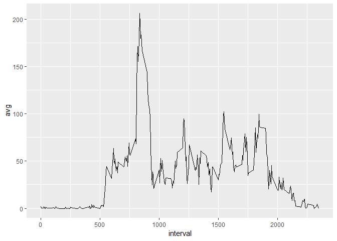
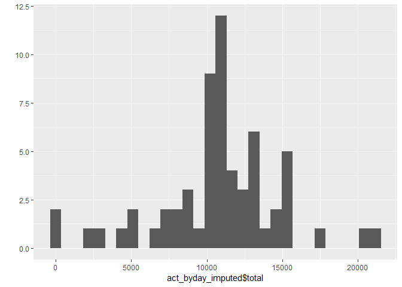
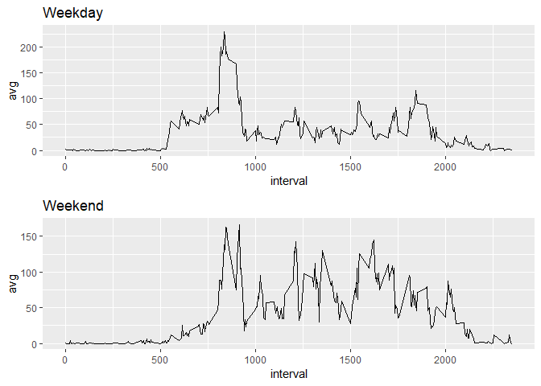

---


## Loading and preprocessing the data

```r
activity_full <- read.csv("activity.csv")
```


## What is mean total number of steps taken per day?
The following section answers the questions:
What is mean total number of steps taken per day?
For this part of the assignment, you can ignore the missing values in the dataset.

1. Calculate the total number of steps taken per day
2. Make a histogram of the total number of steps taken each day
3. Calculate & report mean and median of the total number of steps taken per day
Copy data into table data frame type to use in dplyr package.
Need to sum the steps for each day. So, use dplyr package and group by day.
activity_byday below will contain the total steps taken for each day.
A Histogram is plotted of these total steps taken by day.
Calculate mean steps per day = 10,766.
Calculate median steps per day = 10,765.

```r
library(dplyr)
```

```
## 
## Attaching package: 'dplyr'
```

```
## The following objects are masked from 'package:stats':
## 
##     filter, lag
```

```
## The following objects are masked from 'package:base':
## 
##     intersect, setdiff, setequal, union
```

```r
activity_df <- tbl_df(activity_full) 
activity_clean <- na.omit(activity_df)
activity_day <- group_by(activity_clean, date)
activity_byday <- summarize(activity_day, total = sum(steps))
library(ggplot2)
qplot(activity_byday$total, geom="histogram")
```

```
## `stat_bin()` using `bins = 30`. Pick better value with `binwidth`.
```

<!-- -->

```r
mean_steps_day <- summarize(activity_byday, mean(total))
median_steps_day <- summarize(activity_byday, median(total))
```


## What is the average daily activity pattern?
The following section answers the questions:
What is the average daily activity pattern?
1. Make a time series plot of the 5-minute interval (x-axis) and the average number of steps taken, averaged across all days (y-axis)
2. Which 5-minute interval, on average across all the days in the dataset, contains the maximum number of steps? At 835 interval the maximum average steps
taken in that interval across all days = 206 approx. 

```r
activity_interval <- group_by(activity_clean, interval)
activity_byinterval <- summarize(activity_interval, avg = mean(steps))
ggplot(data=activity_byinterval, aes(x=interval, y=avg)) + geom_line()
```

<!-- -->

```r
summary(activity_byinterval)
```

```
##     interval           avg         
##  Min.   :   0.0   Min.   :  0.000  
##  1st Qu.: 588.8   1st Qu.:  2.486  
##  Median :1177.5   Median : 34.113  
##  Mean   :1177.5   Mean   : 37.383  
##  3rd Qu.:1766.2   3rd Qu.: 52.835  
##  Max.   :2355.0   Max.   :206.170
```

```r
activity_byinterval[100:110,]
```

```
## # A tibble: 11 x 2
##    interval   avg
##       <int> <dbl>
##  1      815  158.
##  2      820  171.
##  3      825  155.
##  4      830  177.
##  5      835  206.
##  6      840  196.
##  7      845  180.
##  8      850  183.
##  9      855  167.
## 10      900  143.
## 11      905  124.
```


## Imputing missing values
The following section answers the questions:
Imputing missing values
Note that there are a number of days/intervals where there are missing values. The presence of missing days may introduce bias into some calculations or summaries of the data.

1. Calculate and report the total number of missing values in the dataset (i.e. the total number of rows with NAs) = 2304. You can get this by subtracting 
number of rows in activity_clean from activity_full.
2. Devise a strategy for filling in all of the missing values in the dataset. The strategy does not need to be sophisticated. For example, you could use the mean/median for that day, or the mean for that 5-minute interval, etc.
Use mean of interval across all days to impute the missing value for that interval.
3. Create a new dataset that is equal to the original dataset but with the missing data filled in. New dataset act_imputed created using above method for impute.
4. Make a histogram of the total number of steps taken each day and Calculate and report the mean and median total number of steps taken per day. Do these values differ from the estimates from the first part of the assignment? What is the impact of imputing missing data on the estimates of the total daily number of steps?
The mean does NOT differ due to the method of imputation.
The median differs by just 1 step between the two datasets.

```r
count_missing <- nrow(activity_full) - nrow(activity_clean)
count_missing
```

```
## [1] 2304
```

```r
ggplot(data=activity_byinterval, aes(x=interval, y=avg)) + geom_line()
```

<!-- -->

```r
summary(activity_byinterval)
```

```
##     interval           avg         
##  Min.   :   0.0   Min.   :  0.000  
##  1st Qu.: 588.8   1st Qu.:  2.486  
##  Median :1177.5   Median : 34.113  
##  Mean   :1177.5   Mean   : 37.383  
##  3rd Qu.:1766.2   3rd Qu.: 52.835  
##  Max.   :2355.0   Max.   :206.170
```

```r
activity_byinterval[100:110,]
```

```
## # A tibble: 11 x 2
##    interval   avg
##       <int> <dbl>
##  1      815  158.
##  2      820  171.
##  3      825  155.
##  4      830  177.
##  5      835  206.
##  6      840  196.
##  7      845  180.
##  8      850  183.
##  9      855  167.
## 10      900  143.
## 11      905  124.
```

```r
act_imputed <- activity_full
for (row in 1:nrow(activity_full)) {
  if (is.na(activity_full[row,1])) {
    act_imputed[row,1] <- activity_byinterval[activity_byinterval$interval == activity_full[row,3],2]
  }
}
act_imp <- tbl_df(act_imputed) 
act_day_imputed <- group_by(act_imp, date)
act_byday_imputed <- summarize(act_day_imputed, total = sum(steps))
qplot(act_byday_imputed$total, geom="histogram")
```

```
## `stat_bin()` using `bins = 30`. Pick better value with `binwidth`.
```

<!-- -->

```r
mean_steps_day_imp <- summarize(act_byday_imputed, mean(total))
median_steps_day_imp <- summarize(act_byday_imputed, median(total))
```


## Are there differences in activity patterns between weekdays and weekends?
The following section answers the questions:
Are there differences in activity patterns between weekdays and weekends?
For this part the weekdays() function may be of some help here. Use the dataset with the filled-in missing values for this part.

1. Create a new factor variable in the dataset with two levels – “weekday” and “weekend” indicating whether a given date is a weekday or weekend day.
Added a new factor variable called day in data frame act_imputed.
2. Make a panel plot containing a time series plot of the 5-minute interval (x-axis) and the average number of steps taken, averaged across all weekday days or weekend days (y-axis). See the README file in the GitHub repository to see an example of what this plot should look like using simulated data.

```r
act_imputed$day <- weekdays(as.Date(act_imputed$date))
for (row in 1:nrow(act_imputed)) {
  if (act_imputed[row,4] == "Saturday" || act_imputed[row,4] == "Sunday" ) {
    act_imputed[row,4] <- c("weekend")
  }
  else {
    act_imputed[row,4] <- c("weekday")
  }
}
act_weekday <- subset(act_imputed, act_imputed$day == "weekday")
act_weekend <- subset(act_imputed, act_imputed$day == "weekend")
act_wday_i <- group_by(act_weekday, interval)
act_wend_i <- group_by(act_weekend, interval)
act_wday_by <- summarize(act_wday_i, avg = mean(steps))
act_wend_by <- summarize(act_wend_i, avg = mean(steps))
library("gridExtra")
```

```
## 
## Attaching package: 'gridExtra'
```

```
## The following object is masked from 'package:dplyr':
## 
##     combine
```

```r
p1 <- ggplot(data=act_wday_by, aes(x=interval, y=avg)) + geom_line() + ggtitle("Weekday")
p2 <- ggplot(data=act_wend_by, aes(x=interval, y=avg)) + geom_line() + ggtitle("Weekend")
grid.arrange(p1, p2, nrow = 2)
```

<!-- -->
